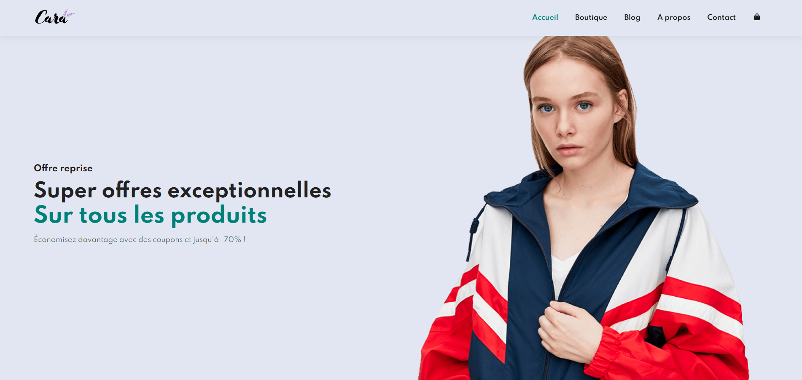

# Cara — Clothing E‑commerce Website

## Description
Simple e‑commerce website for the brand Cara, built with HTML, CSS, and JavaScript.
It includes:
- A homepage
- A shop listing clothes
- A blog
- An About page
- A Contact page

---

## Project Structure

```
cara-boutique/
├─ index.html
├─ boutique.html
├─ blog.html
├─ apropos.html
├─ contact.html
├─ README.md
├─ css/
│  └─ styles.css
├─ js/
│  └─ main.js
└─ assets/
   ├─ hero.jpg
   └─ products/
```

---

## Contenu

* **Accueil** : hero image + section presentations
* **Boutique** : list of clothes in card format
* **Blog** : articles and news
* **À propos** : presentation of the Cara brand
* **Contact** : simple contact form

---

## Hero Image




## Technologies

* **HTML5**
* **CSS3**
* **JavaScript**
